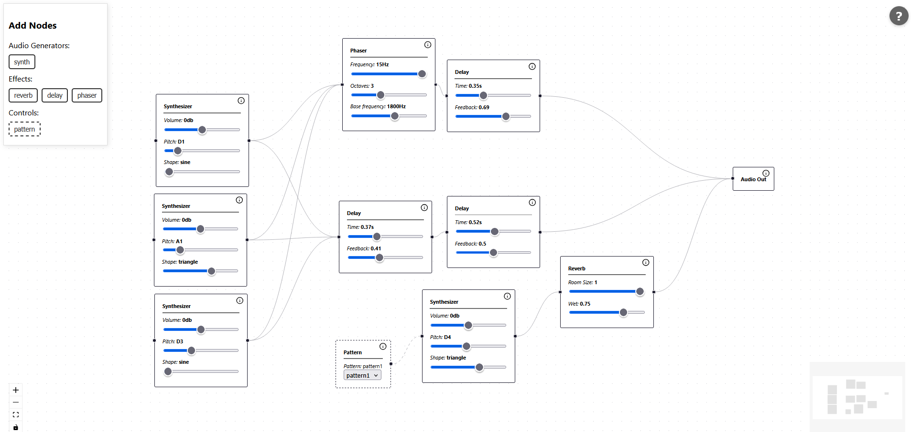
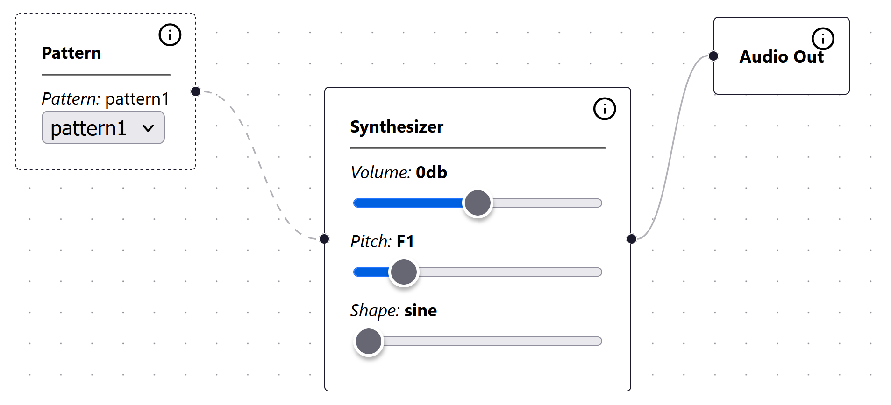
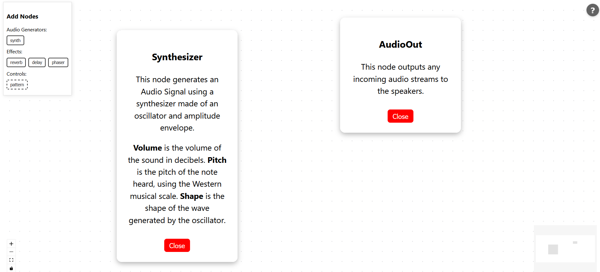

# DAWAAPI

## Introduction

A node-based piece of audio synthesis software, as a layer on top of, and making use of, the Web Audio API. It aims to provide an accessible DAW as a PWA, allowing users to access the application using a browser from anywhere, without an installation overhead.



## Live Version

A live version of the tool can be found [here](https://conarm.github.io/dawaapi/).

## Installation

```sh
npm install
```

## Development

```sh
npm run dev
```

## Build

```sh
npm run build
```

## User Guide

### Usage

A range of nodes can be added to the canvas using the menu. Signals can be sent between them. Sounds can be generated by building a network of these nodes and connecting them to an audio output.

A help button in the top right-hand corner provides usage instructions. Additionally, each node has an information button for specific node information.

### Signals

There are two types of signals:

 - **Audio signal**: Represents a constant stream of audio, like a constant beep or a song
 - **Control signal**: Represents a signal that controls the parameters of some other node

### Nodes

There are three main categories of nodes:
 - Audio generator nodes *[ Input: None, or Control Signal. Output: Audio Signal ]*
   - **Synth**: Sends an audio signal of a single constant note (or a looping pattern if it takes an input from a pattern node)
 - Effect nodes *[ Input: Audio Signal. Output: Audio Signal ]*
   - **Reverb**: Adds reverb to an audio signal
   - **Delay**: Adds delay to an audio signal
   - **Phaser** Adds phaser to an audio signal
 - Control nodes *[ Input: None. Output: Control Signal ]*
   - **Pattern**: When connected to a synthesizer, a control signal will make the synthesizer play a predefined pattern of notes

There is also an **Audio Output** node - any audio signal connected this will be made audible to the user.

Nodes can be connected by dragging the connection dots to the left and right of each node. The left connection dot is an input and the right connection dot is an output. To connect any node X to any node Y, click and drag from node X's right-hand dot (node X's output) to node Y's left-hand dot (node Y's input).

## Example

Below, a Pattern node sends a control signal to a Synth node, telling it to play pattern1. This Synth node sends the resulting audio signal to the audio output, allowing the user to hear the result.




## Help

More information on each node can be seen with the help button in the top right of each node, and detailed general help information can be found through the "?" in the top right of the screen.



## Licensing

The external technologies used in the implementation of this project are as follows:

 - Web Audio API: https://www.w3.org/TR/webaudio-1.1/
 - Svelte, Copyright (c) 2016-2025 Svelte Contributors (MIT license): https://svelte.dev/
 - SvelteFlow, Copyright (c) 2023 xyflow (MIT license): https://svelteflow.dev/
 - Tone.js, Copyright (c) 2014-2020 Yotam Mann (MIT license): https://tonejs.github.io/
